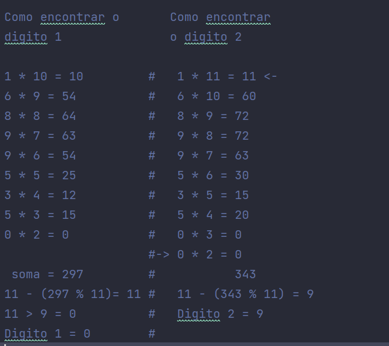

# Desafio - Valide um CPF com 

Neste repositorio apresento minha solução para o desafio de validar um CPF da 2º seção: Python Basico (Lógica de Programação) do curso de python 3 do básico ao avançado (com projetos reais) na plataforma Udemy.

### Requisito do desafio: 
Utilizando os conceitos ensinados até à 2º seção do curso, o objetivo é transformar o algoritmo de cálculo de digitos do CPF da imagem abaixo em uma solução utilizando Python e validar.

### Deploy da aplicação 
Para realização do desafio foi utilizando a IDE Pycharm. 
